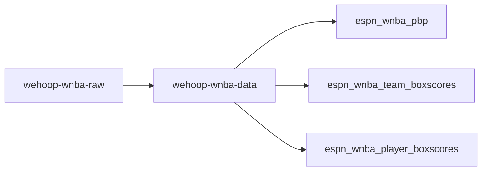
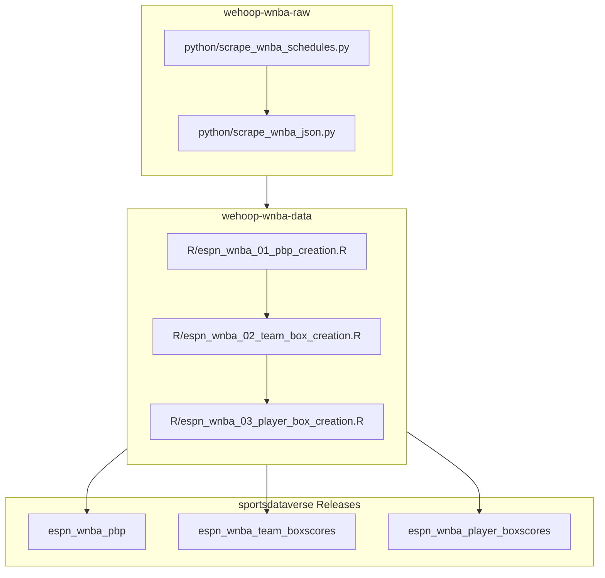

# wehoop-wnba-data

## wehoop ESPN WNBA workflow diagram

## Women's Basketball Data Releases

[ESPN Women's College Basketball Schedules](https://github.com/sportsdataverse/sportsdataverse-data/releases/tag/espn_womens_college_basketball_schedules)

[ESPN Women's College Basketball PBP](https://github.com/sportsdataverse/sportsdataverse-data/releases/tag/espn_womens_college_basketball_pbp)

[ESPN Women's College Basketball Team Boxscores](https://github.com/sportsdataverse/sportsdataverse-data/releases/tag/espn_womens_college_basketball_team_boxscores)

[ESPN Women's College Basketball Player Boxscores](https://github.com/sportsdataverse/sportsdataverse-data/releases/tag/espn_womens_college_basketball_player_boxscores)

[ESPN WNBA Schedules](https://github.com/sportsdataverse/sportsdataverse-data/releases/tag/espn_wnba_schedules)

[ESPN WNBA PBP](https://github.com/sportsdataverse/sportsdataverse-data/releases/tag/espn_wnba_pbp)

[ESPN WNBA Team Boxscores](https://github.com/sportsdataverse/sportsdataverse-data/releases/tag/espn_wnba_team_boxscores)

[ESPN WNBA Player Boxscores](https://github.com/sportsdataverse/sportsdataverse-data/releases/tag/espn_wnba_player_boxscores)

## Data Repositories

[wehoop-wnba-raw data repository (source: ESPN)](https://github.com/sportsdataverse/wehoop-wnba-raw)

[wehoop-wnba-data repository (source: ESPN)](https://github.com/sportsdataverse/wehoop-wnba-data)

[wehoop-wnba-stats-data Repo (source: NBA Stats)](https://github.com/sportsdataverse/wehoop-wnba-stats-data)

[wehoop-wbb-raw data repository (source: ESPN)](https://github.com/sportsdataverse/wehoop-wbb-raw)

[wehoop-wbb-data repository (source: ESPN)](https://github.com/sportsdataverse/wehoop-wbb-data)

## Recent Development Work

### Automated Fork Sync
Added a GitHub Actions workflow (`.github/workflows/sync-fork.yml`) that automatically keeps this fork in sync with the upstream `sportsdataverse/wehoop-wnba-data` repository. The workflow runs daily at 2am EST and can also be triggered manually via `workflow_dispatch`.

### Historical Load to S3
Built a one-time bulk upload process for migrating all existing WNBA parquet files to S3:
- **`scripts/historical_load_s3.sh`** — uploads every parquet file across all four datasets (`pbp`, `player_box`, `schedules`, `team_box`) unconditionally using `aws s3 cp --recursive`, with `INTELLIGENT_TIERING` storage class and an optional `--dry-run` flag for safe previewing.
- **`.github/workflows/historical-load-s3.yml`** — manually triggered (`workflow_dispatch`) GitHub Actions workflow that runs the script using AWS credentials stored as repository secrets.

### Daily Parquet Sync to S3
Built an incremental daily sync process to keep S3 up to date as new data arrives:
- **`scripts/sync_parquet_to_s3.sh`** — uses `aws s3 sync` (ETag-based comparison) to upload only new or changed parquet files, keeping S3 in sync without redundant uploads. Also uses `INTELLIGENT_TIERING` storage class.
- **`.github/workflows/sync-parquet-to-s3.yml`** — scheduled GitHub Actions workflow that runs daily at 3am EST, automatically syncing the latest parquet files to S3 after each WNBA data update.
