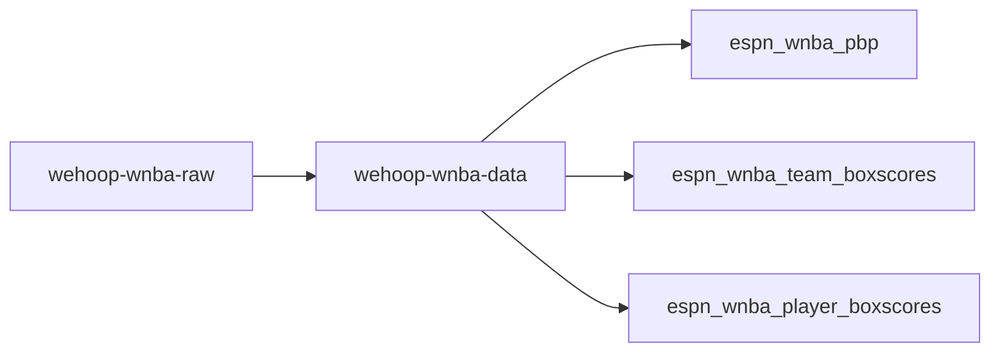
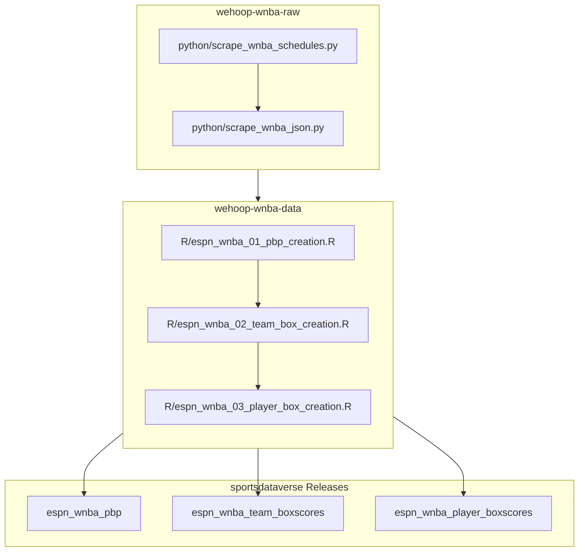

# wehoop-wnba-data

```mermaid
  graph LR;
    A[wehoop-wnba-raw]-->B[wehoop-wnba-data];
    B[wehoop-wnba-data]-->C1[espn_wnba_pbp];
    B[wehoop-wnba-data]-->C2[espn_wnba_team_boxscores];
    B[wehoop-wnba-data]-->C3[espn_wnba_player_boxscores];

```

## wehoop ESPN WNBA workflow diagram

```mermaid
flowchart TB;
    subgraph A[wehoop-wnba-raw];
        direction TB;
        A1[python/scrape_wnba_schedules.py]-->A2[python/scrape_wnba_json.py];
    end;

    subgraph B[wehoop-wnba-data];
        direction TB;
        B1[R/espn_wnba_01_pbp_creation.R]-->B2[R/espn_wnba_02_team_box_creation.R];
        B2[R/espn_wnba_02_team_box_creation.R]-->B3[R/espn_wnba_03_player_box_creation.R];
    end;

    subgraph C[sportsdataverse Releases];
        direction TB;
        C1[espn_wnba_pbp];
        C2[espn_wnba_team_boxscores];
        C3[espn_wnba_player_boxscores];
    end;

    A-->B;
    B-->C1;
    B-->C2;
    B-->C3;

```

## Women's Basketball Data Releases

[ESPN Women's College Basketball Schedules](https://github.com/sportsdataverse/sportsdataverse-data/releases/tag/espn_womens_college_basketball_schedules)

[ESPN Women's College Basketball PBP](https://github.com/sportsdataverse/sportsdataverse-data/releases/tag/espn_womens_college_basketball_pbp)

[ESPN Women's College Basketball Team Boxscores](https://github.com/sportsdataverse/sportsdataverse-data/releases/tag/espn_womens_college_basketball_team_boxscores)

[ESPN Women's College Basketball Player Boxscores](https://github.com/sportsdataverse/sportsdataverse-data/releases/tag/espn_womens_college_basketball_player_boxscores)

[ESPN WNBA Schedules](https://github.com/sportsdataverse/sportsdataverse-data/releases/tag/espn_wnba_schedules)

[ESPN WNBA PBP](https://github.com/sportsdataverse/sportsdataverse-data/releases/tag/espn_wnba_pbp)

[ESPN WNBA Team Boxscores](https://github.com/sportsdataverse/sportsdataverse-data/releases/tag/espn_wnba_team_boxscores)

[ESPN WNBA Player Boxscores](https://github.com/sportsdataverse/sportsdataverse-data/releases/tag/espn_wnba_player_boxscores)

## Data Repositories

[wehoop-wnba-raw data repository (source: ESPN)](https://github.com/sportsdataverse/wehoop-wnba-raw)

[wehoop-wnba-data repository (source: ESPN)](https://github.com/sportsdataverse/wehoop-wnba-data)

[wehoop-wnba-stats-data Repo (source: NBA Stats)](https://github.com/sportsdataverse/wehoop-wnba-stats-data)

[wehoop-wbb-raw data repository (source: ESPN)](https://github.com/sportsdataverse/wehoop-wbb-raw)

[wehoop-wbb-data repository (source: ESPN)](https://github.com/sportsdataverse/wehoop-wbb-data)

## Datasets

<!-- BEGIN GENERATED: datasets -->
| Script | Dataset | Release tag | Last published |
|---|---|---|---|
| [`python/espn_wnba_01_pbp_creation.py`](python/espn_wnba_01_pbp_creation.py) | [`pbp`](docs/datasets/pbp.md) | [`espn_wnba_pbp`](https://github.com/sportsdataverse/sportsdataverse-data/releases/tag/espn_wnba_pbp) | — |
| [`python/espn_wnba_02_team_box_creation.py`](python/espn_wnba_02_team_box_creation.py) | [`team_box`](docs/datasets/team_box.md) | [`espn_wnba_team_boxscores`](https://github.com/sportsdataverse/sportsdataverse-data/releases/tag/espn_wnba_team_boxscores) | — |
| [`python/espn_wnba_03_player_box_creation.py`](python/espn_wnba_03_player_box_creation.py) | [`player_box`](docs/datasets/player_box.md) | [`espn_wnba_player_boxscores`](https://github.com/sportsdataverse/sportsdataverse-data/releases/tag/espn_wnba_player_boxscores) | — |
| [`python/espn_wnba_04_rosters_creation.py`](python/espn_wnba_04_rosters_creation.py) | [`rosters`](docs/datasets/rosters.md) | [`espn_wnba_rosters`](https://github.com/sportsdataverse/sportsdataverse-data/releases/tag/espn_wnba_rosters) | — |
| [`python/espn_wnba_05_player_season_stats_creation.py`](python/espn_wnba_05_player_season_stats_creation.py) | [`player_season_stats`](docs/datasets/player_season_stats.md) | [`espn_wnba_player_season_stats`](https://github.com/sportsdataverse/sportsdataverse-data/releases/tag/espn_wnba_player_season_stats) | — |
| [`python/espn_wnba_06_team_season_stats_creation.py`](python/espn_wnba_06_team_season_stats_creation.py) | [`team_season_stats`](docs/datasets/team_season_stats.md) | [`espn_wnba_team_season_stats`](https://github.com/sportsdataverse/sportsdataverse-data/releases/tag/espn_wnba_team_season_stats) | — |
| [`python/espn_wnba_07_standings_creation.py`](python/espn_wnba_07_standings_creation.py) | [`standings`](docs/datasets/standings.md) | [`espn_wnba_standings`](https://github.com/sportsdataverse/sportsdataverse-data/releases/tag/espn_wnba_standings) | — |
| [`python/espn_wnba_08_draft_creation.py`](python/espn_wnba_08_draft_creation.py) | [`draft`](docs/datasets/draft.md) | [`espn_wnba_draft`](https://github.com/sportsdataverse/sportsdataverse-data/releases/tag/espn_wnba_draft) | — |
| [`python/espn_wnba_09_game_rosters_creation.py`](python/espn_wnba_09_game_rosters_creation.py) | [`game_rosters`](docs/datasets/game_rosters.md) | [`espn_wnba_game_rosters`](https://github.com/sportsdataverse/sportsdataverse-data/releases/tag/espn_wnba_game_rosters) | — |
| [`python/espn_wnba_10_officials_creation.py`](python/espn_wnba_10_officials_creation.py) | [`officials`](docs/datasets/officials.md) | [`espn_wnba_officials`](https://github.com/sportsdataverse/sportsdataverse-data/releases/tag/espn_wnba_officials) | — |
| [`python/espn_wnba_11_team_crosswalk_creation.py`](python/espn_wnba_11_team_crosswalk_creation.py) | [`team_crosswalk`](docs/datasets/team_crosswalk.md) | [`wnba_crosswalk`](https://github.com/sportsdataverse/sportsdataverse-data/releases/tag/wnba_crosswalk) | — |
| [`python/espn_wnba_12_schedule_crosswalk_creation.py`](python/espn_wnba_12_schedule_crosswalk_creation.py) | [`schedule_crosswalk`](docs/datasets/schedule_crosswalk.md) | [`wnba_crosswalk`](https://github.com/sportsdataverse/sportsdataverse-data/releases/tag/wnba_crosswalk) | — |
| [`python/espn_wnba_13_player_crosswalk_creation.py`](python/espn_wnba_13_player_crosswalk_creation.py) | [`player_crosswalk`](docs/datasets/player_crosswalk.md) | [`wnba_crosswalk`](https://github.com/sportsdataverse/sportsdataverse-data/releases/tag/wnba_crosswalk) | — |
| [`python/espn_wnba_14_schedules_creation.py`](python/espn_wnba_14_schedules_creation.py) | [`schedules`](docs/datasets/schedules.md) | [`espn_wnba_schedules`](https://github.com/sportsdataverse/sportsdataverse-data/releases/tag/espn_wnba_schedules) | — |
| [`python/espn_wnba_15_shots_creation.py`](python/espn_wnba_15_shots_creation.py) | [`shots`](docs/datasets/shots.md) | [`espn_wnba_shots`](https://github.com/sportsdataverse/sportsdataverse-data/releases/tag/espn_wnba_shots) | — |
| [`python/espn_wnba_16_player_core_creation.py`](python/espn_wnba_16_player_core_creation.py) | [`player_core`](docs/datasets/player_core.md) | [`espn_wnba_player_core`](https://github.com/sportsdataverse/sportsdataverse-data/releases/tag/espn_wnba_player_core) | — |
<!-- END GENERATED: datasets -->
