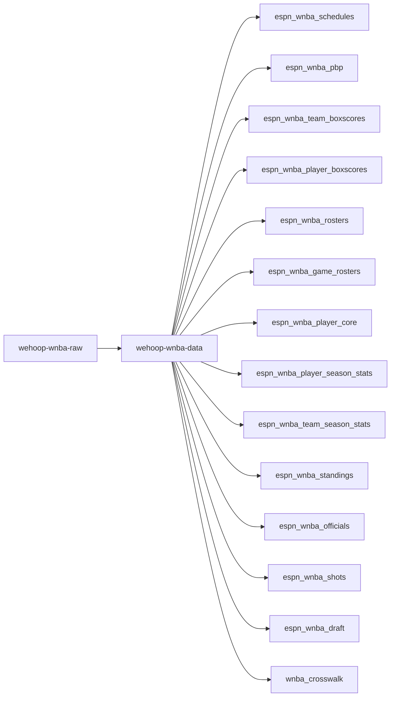
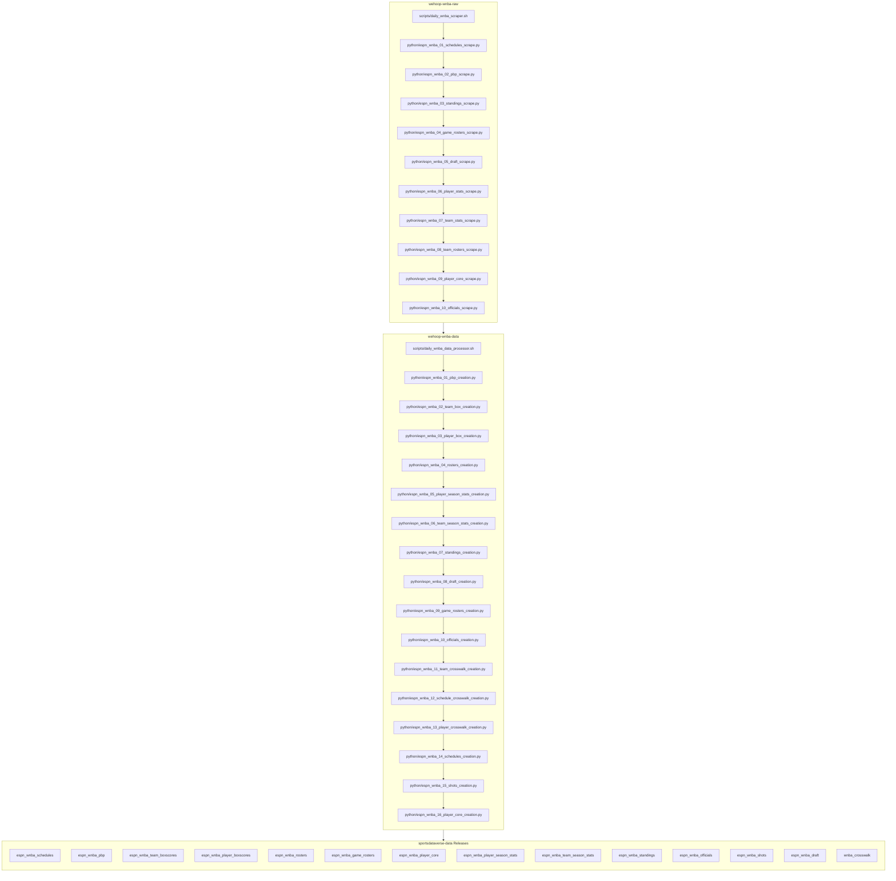

# wehoop-wnba-data

## wehoop ESPN WNBA workflow diagram

```mermaid
  graph LR;
    A[wehoop-wnba-raw]-->B[wehoop-wnba-data];
    B[wehoop-wnba-data]-->C1[espn_wnba_schedules];
    B[wehoop-wnba-data]-->C2[espn_wnba_pbp];
    B[wehoop-wnba-data]-->C3[espn_wnba_team_boxscores];
    B[wehoop-wnba-data]-->C4[espn_wnba_player_boxscores];
    B[wehoop-wnba-data]-->C5[espn_wnba_rosters];
    B[wehoop-wnba-data]-->C6[espn_wnba_game_rosters];
    B[wehoop-wnba-data]-->C7[espn_wnba_player_core];
    B[wehoop-wnba-data]-->C8[espn_wnba_player_season_stats];
    B[wehoop-wnba-data]-->C9[espn_wnba_team_season_stats];
    B[wehoop-wnba-data]-->C10[espn_wnba_standings];
    B[wehoop-wnba-data]-->C11[espn_wnba_officials];
    B[wehoop-wnba-data]-->C12[espn_wnba_shots];
    B[wehoop-wnba-data]-->C13[espn_wnba_draft];
    B[wehoop-wnba-data]-->C14[wnba_crosswalk];
```

```mermaid
flowchart TB;
    subgraph A[wehoop-wnba-raw];
        direction TB;
        A0[scripts/daily_wnba_scraper.sh]-->A1[python/espn_wnba_01_schedules_scrape.py];
        A1[python/espn_wnba_01_schedules_scrape.py]-->A2[python/espn_wnba_02_pbp_scrape.py];
        A2[python/espn_wnba_02_pbp_scrape.py]-->A3[python/espn_wnba_03_standings_scrape.py];
        A3[python/espn_wnba_03_standings_scrape.py]-->A4[python/espn_wnba_04_game_rosters_scrape.py];
        A4[python/espn_wnba_04_game_rosters_scrape.py]-->A5[python/espn_wnba_05_draft_scrape.py];
        A5[python/espn_wnba_05_draft_scrape.py]-->A6[python/espn_wnba_06_player_stats_scrape.py];
        A6[python/espn_wnba_06_player_stats_scrape.py]-->A7[python/espn_wnba_07_team_stats_scrape.py];
        A7[python/espn_wnba_07_team_stats_scrape.py]-->A8[python/espn_wnba_08_team_rosters_scrape.py];
        A8[python/espn_wnba_08_team_rosters_scrape.py]-->A9[python/espn_wnba_09_player_core_scrape.py];
        A9[python/espn_wnba_09_player_core_scrape.py]-->A10[python/espn_wnba_10_officials_scrape.py];
    end;

    subgraph B[wehoop-wnba-data];
        direction TB;
        B0[scripts/daily_wnba_data_processor.sh]-->B1[python/espn_wnba_01_pbp_creation.py];
        B1[python/espn_wnba_01_pbp_creation.py]-->B2[python/espn_wnba_02_team_box_creation.py];
        B2[python/espn_wnba_02_team_box_creation.py]-->B3[python/espn_wnba_03_player_box_creation.py];
        B3[python/espn_wnba_03_player_box_creation.py]-->B4[python/espn_wnba_04_rosters_creation.py];
        B4[python/espn_wnba_04_rosters_creation.py]-->B5[python/espn_wnba_05_player_season_stats_creation.py];
        B5[python/espn_wnba_05_player_season_stats_creation.py]-->B6[python/espn_wnba_06_team_season_stats_creation.py];
        B6[python/espn_wnba_06_team_season_stats_creation.py]-->B7[python/espn_wnba_07_standings_creation.py];
        B7[python/espn_wnba_07_standings_creation.py]-->B8[python/espn_wnba_08_draft_creation.py];
        B8[python/espn_wnba_08_draft_creation.py]-->B9[python/espn_wnba_09_game_rosters_creation.py];
        B9[python/espn_wnba_09_game_rosters_creation.py]-->B10[python/espn_wnba_10_officials_creation.py];
        B10[python/espn_wnba_10_officials_creation.py]-->B11[python/espn_wnba_11_team_crosswalk_creation.py];
        B11[python/espn_wnba_11_team_crosswalk_creation.py]-->B12[python/espn_wnba_12_schedule_crosswalk_creation.py];
        B12[python/espn_wnba_12_schedule_crosswalk_creation.py]-->B13[python/espn_wnba_13_player_crosswalk_creation.py];
        B13[python/espn_wnba_13_player_crosswalk_creation.py]-->B14[python/espn_wnba_14_schedules_creation.py];
        B14[python/espn_wnba_14_schedules_creation.py]-->B15[python/espn_wnba_15_shots_creation.py];
        B15[python/espn_wnba_15_shots_creation.py]-->B16[python/espn_wnba_16_player_core_creation.py];
    end;

    subgraph C[sportsdataverse-data Releases];
        direction TB;
        C1[espn_wnba_schedules];
        C2[espn_wnba_pbp];
        C3[espn_wnba_team_boxscores];
        C4[espn_wnba_player_boxscores];
        C5[espn_wnba_rosters];
        C6[espn_wnba_game_rosters];
        C7[espn_wnba_player_core];
        C8[espn_wnba_player_season_stats];
        C9[espn_wnba_team_season_stats];
        C10[espn_wnba_standings];
        C11[espn_wnba_officials];
        C12[espn_wnba_shots];
        C13[espn_wnba_draft];
        C14[wnba_crosswalk];
    end;

    A-->B;
    B-->C;
```

`scripts/daily_wnba_scraper.sh` and `scripts/daily_wnba_data_processor.sh` are the
daily drivers (the `00` role); stage numbers are intended build order, not run order.
`scripts/annual_wnba_draft_scraper.sh` covers the mid-April draft the daily cron window misses.

[wehoop-wbb-raw repository (source: ESPN)](https://github.com/sportsdataverse/wehoop-wbb-raw)

[wehoop-wbb-data repository (source: ESPN)](https://github.com/sportsdataverse/wehoop-wbb-data)

[wehoop-wnba-raw repository (source: ESPN)](https://github.com/sportsdataverse/wehoop-wnba-raw)

[wehoop-wnba-data repository (source: ESPN)](https://github.com/sportsdataverse/wehoop-wnba-data)

[wehoop-wnba-stats-raw repository (source: WNBA Stats)](https://github.com/sportsdataverse/wehoop-wnba-stats-raw)

[wehoop-wnba-stats-data repository (source: WNBA Stats)](https://github.com/sportsdataverse/wehoop-wnba-stats-data)

[ncaa-wbb-hoops-raw repository (source: stats.ncaa.org)](https://github.com/sportsdataverse/ncaa-wbb-hoops-raw)

[ncaa-wbb-hoops-data repository (source: stats.ncaa.org)](https://github.com/sportsdataverse/ncaa-wbb-hoops-data)

## Women's Basketball Data Releases

[ESPN Women's College Basketball Schedules](https://github.com/sportsdataverse/sportsdataverse-data/releases/tag/espn_womens_college_basketball_schedules)

[ESPN Women's College Basketball PBP](https://github.com/sportsdataverse/sportsdataverse-data/releases/tag/espn_womens_college_basketball_pbp)

[ESPN Women's College Basketball Team Boxscores](https://github.com/sportsdataverse/sportsdataverse-data/releases/tag/espn_womens_college_basketball_team_boxscores)

[ESPN Women's College Basketball Player Boxscores](https://github.com/sportsdataverse/sportsdataverse-data/releases/tag/espn_womens_college_basketball_player_boxscores)

[ESPN WNBA Schedules](https://github.com/sportsdataverse/sportsdataverse-data/releases/tag/espn_wnba_schedules)

[ESPN WNBA PBP](https://github.com/sportsdataverse/sportsdataverse-data/releases/tag/espn_wnba_pbp)

[ESPN WNBA Team Boxscores](https://github.com/sportsdataverse/sportsdataverse-data/releases/tag/espn_wnba_team_boxscores)

[ESPN WNBA Player Boxscores](https://github.com/sportsdataverse/sportsdataverse-data/releases/tag/espn_wnba_player_boxscores)

## Data Repositories

[wehoop-wnba-raw data repository (source: ESPN)](https://github.com/sportsdataverse/wehoop-wnba-raw)

[wehoop-wnba-data repository (source: ESPN)](https://github.com/sportsdataverse/wehoop-wnba-data)

[wehoop-wnba-stats-data Repo (source: NBA Stats)](https://github.com/sportsdataverse/wehoop-wnba-stats-data)

[wehoop-wbb-raw data repository (source: ESPN)](https://github.com/sportsdataverse/wehoop-wbb-raw)

[wehoop-wbb-data repository (source: ESPN)](https://github.com/sportsdataverse/wehoop-wbb-data)

## Datasets

<!-- BEGIN GENERATED: datasets -->
| Script | Dataset | Release tag | Last published |
|---|---|---|---|
| [`python/espn_wnba_01_pbp_creation.py`](python/espn_wnba_01_pbp_creation.py) | [`pbp`](docs/datasets/pbp.md) | [`espn_wnba_pbp`](https://github.com/sportsdataverse/sportsdataverse-data/releases/tag/espn_wnba_pbp) | — |
| [`python/espn_wnba_02_team_box_creation.py`](python/espn_wnba_02_team_box_creation.py) | [`team_box`](docs/datasets/team_box.md) | [`espn_wnba_team_boxscores`](https://github.com/sportsdataverse/sportsdataverse-data/releases/tag/espn_wnba_team_boxscores) | — |
| [`python/espn_wnba_03_player_box_creation.py`](python/espn_wnba_03_player_box_creation.py) | [`player_box`](docs/datasets/player_box.md) | [`espn_wnba_player_boxscores`](https://github.com/sportsdataverse/sportsdataverse-data/releases/tag/espn_wnba_player_boxscores) | — |
| [`python/espn_wnba_04_rosters_creation.py`](python/espn_wnba_04_rosters_creation.py) | [`rosters`](docs/datasets/rosters.md) | [`espn_wnba_rosters`](https://github.com/sportsdataverse/sportsdataverse-data/releases/tag/espn_wnba_rosters) | — |
| [`python/espn_wnba_05_player_season_stats_creation.py`](python/espn_wnba_05_player_season_stats_creation.py) | [`player_season_stats`](docs/datasets/player_season_stats.md) | [`espn_wnba_player_season_stats`](https://github.com/sportsdataverse/sportsdataverse-data/releases/tag/espn_wnba_player_season_stats) | — |
| [`python/espn_wnba_06_team_season_stats_creation.py`](python/espn_wnba_06_team_season_stats_creation.py) | [`team_season_stats`](docs/datasets/team_season_stats.md) | [`espn_wnba_team_season_stats`](https://github.com/sportsdataverse/sportsdataverse-data/releases/tag/espn_wnba_team_season_stats) | — |
| [`python/espn_wnba_07_standings_creation.py`](python/espn_wnba_07_standings_creation.py) | [`standings`](docs/datasets/standings.md) | [`espn_wnba_standings`](https://github.com/sportsdataverse/sportsdataverse-data/releases/tag/espn_wnba_standings) | — |
| [`python/espn_wnba_08_draft_creation.py`](python/espn_wnba_08_draft_creation.py) | [`draft`](docs/datasets/draft.md) | [`espn_wnba_draft`](https://github.com/sportsdataverse/sportsdataverse-data/releases/tag/espn_wnba_draft) | — |
| [`python/espn_wnba_09_game_rosters_creation.py`](python/espn_wnba_09_game_rosters_creation.py) | [`game_rosters`](docs/datasets/game_rosters.md) | [`espn_wnba_game_rosters`](https://github.com/sportsdataverse/sportsdataverse-data/releases/tag/espn_wnba_game_rosters) | — |
| [`python/espn_wnba_10_officials_creation.py`](python/espn_wnba_10_officials_creation.py) | [`officials`](docs/datasets/officials.md) | [`espn_wnba_officials`](https://github.com/sportsdataverse/sportsdataverse-data/releases/tag/espn_wnba_officials) | — |
| [`python/espn_wnba_11_team_crosswalk_creation.py`](python/espn_wnba_11_team_crosswalk_creation.py) | [`team_crosswalk`](docs/datasets/team_crosswalk.md) | [`wnba_crosswalk`](https://github.com/sportsdataverse/sportsdataverse-data/releases/tag/wnba_crosswalk) | — |
| [`python/espn_wnba_12_schedule_crosswalk_creation.py`](python/espn_wnba_12_schedule_crosswalk_creation.py) | [`schedule_crosswalk`](docs/datasets/schedule_crosswalk.md) | [`wnba_crosswalk`](https://github.com/sportsdataverse/sportsdataverse-data/releases/tag/wnba_crosswalk) | — |
| [`python/espn_wnba_13_player_crosswalk_creation.py`](python/espn_wnba_13_player_crosswalk_creation.py) | [`player_crosswalk`](docs/datasets/player_crosswalk.md) | [`wnba_crosswalk`](https://github.com/sportsdataverse/sportsdataverse-data/releases/tag/wnba_crosswalk) | — |
| [`python/espn_wnba_14_schedules_creation.py`](python/espn_wnba_14_schedules_creation.py) | [`schedules`](docs/datasets/schedules.md) | [`espn_wnba_schedules`](https://github.com/sportsdataverse/sportsdataverse-data/releases/tag/espn_wnba_schedules) | — |
| [`python/espn_wnba_15_shots_creation.py`](python/espn_wnba_15_shots_creation.py) | [`shots`](docs/datasets/shots.md) | [`espn_wnba_shots`](https://github.com/sportsdataverse/sportsdataverse-data/releases/tag/espn_wnba_shots) | — |
| [`python/espn_wnba_16_player_core_creation.py`](python/espn_wnba_16_player_core_creation.py) | [`player_core`](docs/datasets/player_core.md) | [`espn_wnba_player_core`](https://github.com/sportsdataverse/sportsdataverse-data/releases/tag/espn_wnba_player_core) | — |
<!-- END GENERATED: datasets -->

## Automation & status

<!-- BEGIN GENERATED: status -->

| workflow | schedule | last run |
|---|---|---|
|  | day 15 08:00 UTC in Apr; day 16 08:00 UTC in Apr | 2026-05-30 |
|  | days 18-31 07:00 UTC in Oct; daily 07:00 UTC in Nov-Dec; daily 07:00 UTC in Jan-Jun; days 1-12 07:00 UTC in Jul | 2026-08-31 |
|  | on push / PR / dispatch | 2026-08-24 |
|  | on push / PR / dispatch | 2026-08-27 |
|  | Mondays 09:00 UTC | 2026-08-31 |
|  | Sundays 06:00 UTC | 2026-08-30 |

| release tag | assets | size | last publish |
|---|---:|---:|---|
| [`espn_wnba_schedules`](https://github.com/sportsdataverse/sportsdataverse-data/releases/tag/espn_wnba_schedules) | 85 | 23.3 MB | 2026-08-31 |
| [`espn_wnba_pbp`](https://github.com/sportsdataverse/sportsdataverse-data/releases/tag/espn_wnba_pbp) | 79 | 1,008.4 MB | 2026-08-31 |
| [`espn_wnba_team_boxscores`](https://github.com/sportsdataverse/sportsdataverse-data/releases/tag/espn_wnba_team_boxscores) | 76 | 6.1 MB | 2026-08-31 |
| [`espn_wnba_player_boxscores`](https://github.com/sportsdataverse/sportsdataverse-data/releases/tag/espn_wnba_player_boxscores) | 79 | 60.8 MB | 2026-08-31 |
| [`espn_wnba_rosters`](https://github.com/sportsdataverse/sportsdataverse-data/releases/tag/espn_wnba_rosters) | 14 | 0.4 MB | 2026-08-31 |
| [`espn_wnba_game_rosters`](https://github.com/sportsdataverse/sportsdataverse-data/releases/tag/espn_wnba_game_rosters) | 80 | 28.7 MB | 2026-08-31 |
| [`espn_wnba_player_core`](https://github.com/sportsdataverse/sportsdataverse-data/releases/tag/espn_wnba_player_core) | 72 | 2.2 MB | 2026-08-31 |
| [`espn_wnba_player_season_stats`](https://github.com/sportsdataverse/sportsdataverse-data/releases/tag/espn_wnba_player_season_stats) | 75 | 28.7 MB | 2026-08-31 |
| [`espn_wnba_team_season_stats`](https://github.com/sportsdataverse/sportsdataverse-data/releases/tag/espn_wnba_team_season_stats) | 75 | 3.2 MB | 2026-08-31 |
| [`espn_wnba_standings`](https://github.com/sportsdataverse/sportsdataverse-data/releases/tag/espn_wnba_standings) | 76 | 1.8 MB | 2026-08-31 |
| [`espn_wnba_officials`](https://github.com/sportsdataverse/sportsdataverse-data/releases/tag/espn_wnba_officials) | 73 | 1.4 MB | 2026-08-31 |
| [`espn_wnba_shots`](https://github.com/sportsdataverse/sportsdataverse-data/releases/tag/espn_wnba_shots) | 80 | 139.6 MB | 2026-08-31 |
| [`espn_wnba_draft`](https://github.com/sportsdataverse/sportsdataverse-data/releases/tag/espn_wnba_draft) | 24 | 0.2 MB | 2026-07-16 |
| [`wnba_crosswalk`](https://github.com/sportsdataverse/sportsdataverse-data/releases/tag/wnba_crosswalk) | 16 | 0.1 MB | 2026-08-24 |

<!-- END GENERATED: status -->
